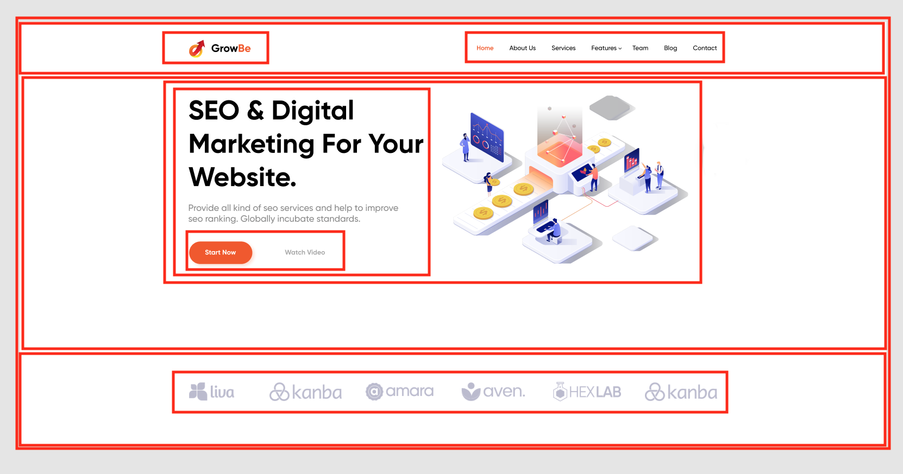

# Основы веб-верстки HTML/CSS

## Урок 2. Семинар. Введение и Основы HTML
1. Скачать и настроить редактор кода, если этого не сделали на семинаре.
2. Создать пустую папку, придумать название.
3. Создать первую html страницу (index.html).
4. Добавить структуру html документа.
5. Добавить меню сайта (Меню сайта должно быть на каждой странице, оно должно быть одинаковым): a. Главная b. Каталог c. Контакты
6. Создать заголовок h1 с текстом “Главная страница”.
7. Добавить параграф p с произвольным текстом (lorem) (используем расширение emmet уже установленное в vsc, для этого вводим lorem и нажимаем клавишу tab).
8. Создать подзаголовок h2 с текстом “Добро пожаловать на сайт”.
9. Добавить три параграф p с произвольным текстом (lorem).
10. Рядом с файлом index.html создать папку catalog.
11. Внутри папки catalog создать файл catalog.html.
12. На странице “каталог” добавить структуру html-документа.
13. Добавить меню сайта (такое же как на главной странице).
14. Добавить Заголовок h1 с текстом “Каталог”.
15. Создать параграф p с произвольным текстом из 150 слов для этого вводим “lorem150” и нажимаем tab.
16. Сделать переходы с главной страницы на страницу каталог, при нажатии на меню сайта и переход со страницы каталог на главную страницу.
17. Создать папку img и разместить ее рядом с index.html.
18. Добавить в папку img произвольные фотографии товаров, по вашей тематике можно выбрать любое фото https://www.freepik.com/search?format=search&orientation=portrait&query=products
19. На странице “Каталог” после заголовка h1 и параграфа p добавить a. Изображение товара b. Название товара c. Описание товара
20. Добавить 3 таких товара на страницу каталога (не следует добавлять более 3-х товаров)

[link for home work folder](./lesson_1/home_work/)


## Урок 4. Семинар. Основы CSS
Данная домашняя работа является продолжение предыдущей, не забываем использовать работу из прошлого урока

1. Открыть Домашнюю работу из урока 1.

2. Создать файл стилей style.css

3. Подключить ко всем страницам

4. Задать стиль

    ```css
    a {
        text-decoration: none;
    }
    ```

5. Проверить работу стилей на всех страницах.

6. Разделить экран на 2 части, сделать так чтобы файл стилей располагался справа, а все html-файлы были слева.

7. Для всех ссылок меню задать класс (придумать логичное название класса)
```css
* color: cornflowerblue;
* font-size: 16px;
* line-height: 20px;
```

8. Проверить отображения стилей на всех страницах проекта.

9. Для всех заголовков h1 на сайте задать класс и к нему стиль
```css
* color: #222222;
* font-size: 28px;
* line-height: 36px;
* font-weight: bold;
```

10. Для всех параграфов в проекте задать класс.

11. К данному классу задать стили:
```css
* font-style: normal;
* font-weight: 300;
* font-size: 18px;
* line-height: 30px;
* color: #7D7987;
```

12. Для заголовков h2 задать класс.

13. К данному классу указать стиль:
```css
* color: coral;
* font-style: normal;
* font-weight: 700;
* font-size: 36px;
* line-height: 80px;
```

[link for home work folder](./lesson_1/home_work/)


## Урок 6. Семинар. Работа с макетом и cоздание блочной структуры

1. Открыть макет [сайта](https://www.figma.com/file/mnLY69cYE5cqWM5w6n5hXx/Seo-%26-Digital-Marketing-Landing-Page?node-id=23%3A2).
2. Необходимо представить разбиение часть на блоки (Для тех учеников, которые умеют работать с Figma, разбить представленную на скриншоте часть на блоки, как в семинаре).

3. Создать новую папку.
4. Создать файл [index.html](./lesson_6/home_work/index.html).
5. В соответствии с макетом необходимо:
6. Добавить все блоки по сайту
7. Добавить все наполнение блоков (html контент)
8. Все заголовки, параграфы кнопки и изображения Позиционирование задавать не нужно
9. Создать файл стилей [style.css](./lesson_6/home_work/style.css): 
    - Подключить стили к index.html. 
    - Добавить обнуление стилей. 
    - Добавить все необходимые отступы margin, padding. Все домашние задания являются повторением того что делается на семинаре, поэтому перед выполнением обязательно посмотрите семинар.

[link for home work folder](./lesson_6/home_work/)


## Урок 8. Семинар. Основы позиционирования (вебинар)

Мы продолжаем работать с [проектом](https://www.figma.com/file/mnLY69cYE5cqWM5w6n5hXx/Seo-%26-Digital-Marketing-Landing-Page?node-id=186%3A2) из прошлого урока 
В данном домашнем задании мы будем добавлять стилистику и позиционирование для верхнего блока сайта

1. Для всех html-элементов из прошлого урока, вам необходимо задать стили в соответствии с макетом.

2. Расставить все элементы в соответствии с макетом.

[link for home work folder](./lesson_6/home_work/)


## Урок 9. Семинар. Основы позиционирования

Тем, кто не был на семинаре, необходимо пройти [игру](http://flexboxfroggy.com/#ru) 

Мы продолжаем работать с [проектом](https://www.figma.com/file/mnLY69cYE5cqWM5w6n5hXx/Seo-%26-Digital-Marketing-Landing-Page?node-id=186%3A47) из прошлого урока. 

В данном домашнем задании мы будем добавлять стилистику и позиционирование для следующего блока сайта


1. Добавить весь контент из макета.

2. Ко всем элементам контента добавить классы.

3. Добавить стили для всего контента сайта.

4. Расставить элементы в соответствии с макетом.

[link for home work folder](./lesson_6/home_work/)


## Урок 11. Семинар. Основы создания адаптивного сайта

Мы приступаем к созданию нового адаптивного [проекта](https://www.figma.com/file/mnLY69cYE5cqWM5w6n5hXx/Seo-%26-Digital-Marketing-Landing-Page?node-id=188%3A2)

Мы уже отлично умеем работать с макетом, в этом и есть основная задача верстальщика

1. Создать новую папку, в ней сделать заготовку:
* index.html
* style.css
* img

2. Полностью реализовать вёрстку проекта:
* Добавить весь контент из макета.
* Ко всем элементам контента добавить классы.
* Добавить стили для всего контента сайта.
* Расставить элементы в соответствии с макетом.
* Адаптив создавать не нужно.

[link for homework folder](./lesson_11/)  ++ выполнил index__hover

Скрин готовой вёрстки.


___

## Урок 12. Семинар. Основы создания адаптивного сайта (вебинар)
[Макет](https://www.figma.com/file/mnLY69cYE5cqWM5w6n5hXx/Seo-%26-Digital-Marketing-Landing-Page?node-id=188%3A673) 

В данном уроке мы переходим к созданию планшетной версии проекта.

1. Создать медиа запрос, чтобы наш проект отлично смотрелся на разрешениях экрана 768-1024.

2. Создать планшетную версию проекта.

3. Мобильную версию сайта создавать не нужно.

[link for homework folder](./lesson_11/)  ++ выполнил index__hover

Скрин готовой вёрстки.

